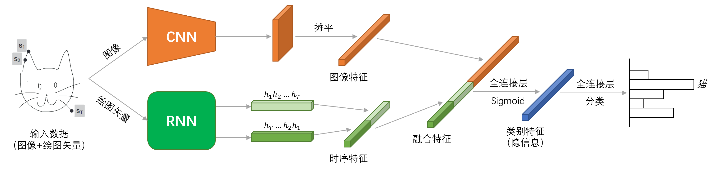

机器学习大作业：手绘草图分类问题
===


## 结果一览
| 模型名称 | 文件名 | 测试集准确率 | 备注 |
| :-----: | -------- | :------: | ---- |
| RF | `traditional_methods.ipynb` | 0.4775 | 小型数据集，最大特征数50 |
| KNN | `traditional_methods.ipynb` | 0.3949 | 小型数据集，$K=9$ |
| SVM | `traditional_methods.ipynb` | 0.2716 | 小型数据集，线性核 |
| CNN Baseline | `baselineCNN.py` | 0.7721 | 简单的双层CNN |
| CNN ResNet | `ResNetCNN.py` | 0.7948 | 使用了ResNet-50的CNN |
| RNN Baseline | `baselineRNN.py` | 0.8205 | 简单的双向LSTM |
| Simple Two-branch | `SimpleTwoBranch.py` | 0.8406 | 简单CNN与简单RNN组成的分支网络 |
| Position Two-branch | `PositionTwoBranch.py` | 0.8411 | 将绝对坐标信息融入到绘图矢量后的分支网络 |
| Centering Two-branch | `HashingTwoBranch.py` | **0.8436** | 提取类别特征中心并微调的分支网络 |
| ResNet Centering Two-branch | `ResNetTwoBranch.py` | 0.8424 | 使用ResNet-50替代CNN的提取类别特征中心并微调的分支网络 |

在`./figures`文件夹下也存储了各个模型在测试集上的预测结果混淆矩阵等结果可视化信息。

## 运行方法
对`.ipynb`文件，我们保留了各个单元格的输出结果；若想自行运行，直接依次运行单元格即可。运行前需要保证`./datasets`文件夹下存储有相应的数据集。  
对结果一览中的`.py`文件，使用以下命令来运行：
```
python 要运行的文件.py <附加选项>
```
程序默认读取`./datasets`文件夹下的数据集。若想修改数据集的读取路径，可以使用`--data_path`等选项向程序中传入参数。更详细的参数可以参见各个文件开头的`parse_args`函数定义部分。

## 其他文件
| 文件名 | 描述 |
| ----- | ---- |
| `data_processor.py` | 定义数据集，读取指定路径下的数据，将其转换为程序易于处理的形式。 |
| `models.py` | 定义各个深度学习网络的模型。 |
| `ResNet50.py` | 残差网络ResNet-50的模型定义。 |
| `visulization.py` | 对能够提取类别特征的网络，该文件将从数据中提取到的特征用t-SNE降维并可视化，以便查看特征聚类的效果。 |
